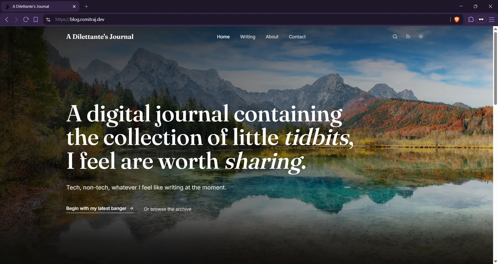

# A Dilettante's Journal

[](https://blog.romitraj.dev/)

**Live site:** [blog.romitraj.dev](https://blog.romitraj.dev)

A personal blog for whatever I feel like writing at the moment. Built with Astro, self-hosted on my own server, edited through a custom Keystatic CMS setup.

## What this is

A static Astro blog with a Git-based CMS wired to match the site's content conventions, self-hosted comments and analytics, and automatic deployment on push.

## Stack

- **Astro**, static site generation, MDX content
- **Tailwind CSS**
- **Keystatic**, Git-based CMS
- **GitHub Actions**, syncs post tags/categories automatically
- **Remark42**, self-hosted comments
- **Rybbit**, self-hosted analytics
- **Dokploy**, self-hosted deployment

## Getting Started

Install dependencies:

```bash
npm install
```

Start the development server:

```bash
npm run dev
```

Build for production:

```bash
npm run build
```

Preview the production build locally:

```bash
npm run preview
```

## Content

Blog posts live in `src/content/blog`. Each post is an `index.mdx` file inside its own folder, with local images stored beside the content.

Required frontmatter: `title`, `excerpt`, `date`, `category`, `tags`, `author`, `thumbnail`, `thumbnailAlt`

Posts can be edited three ways: through the Keystatic admin UI at `/keystatic`, directly on GitHub, or locally by editing files and pushing.

## Taxonomy Sync

A GitHub Action keeps the site's tag and category lists in sync with what's actually used across posts. New tags and categories get added automatically, unused ones get removed.

## Comments and Analytics

Comments run on a self-hosted [Remark42](https://remark42.com) instance. Analytics run on a self-hosted [Rybbit](https://rybbit.io) instance. Both are separate services from the blog itself.

## License

MIT, see [LICENSE](LICENSE).
