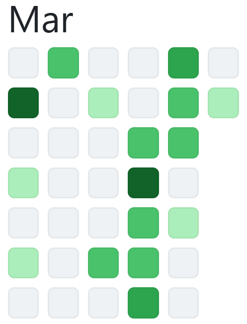
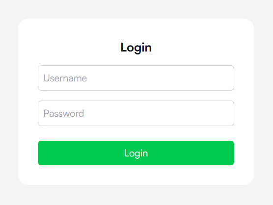
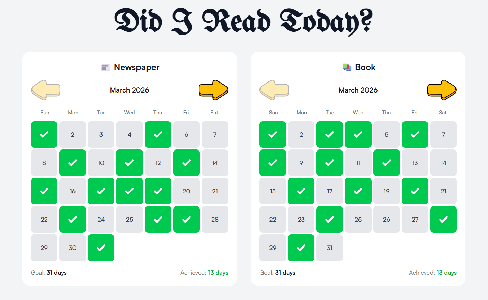
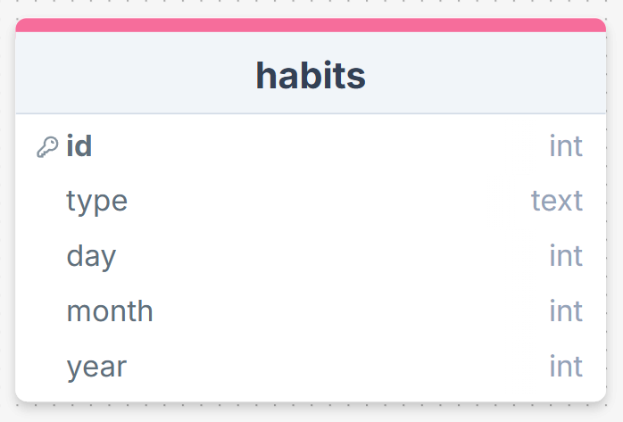
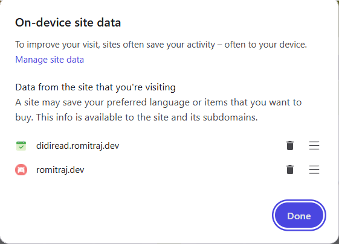
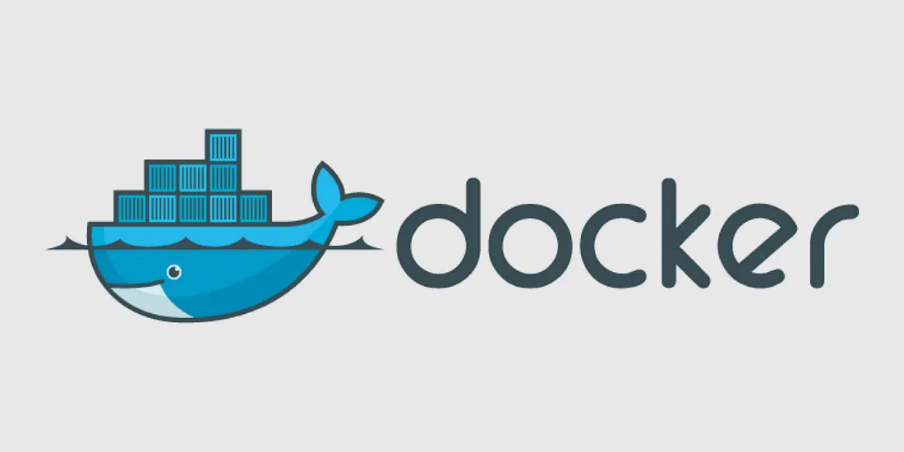
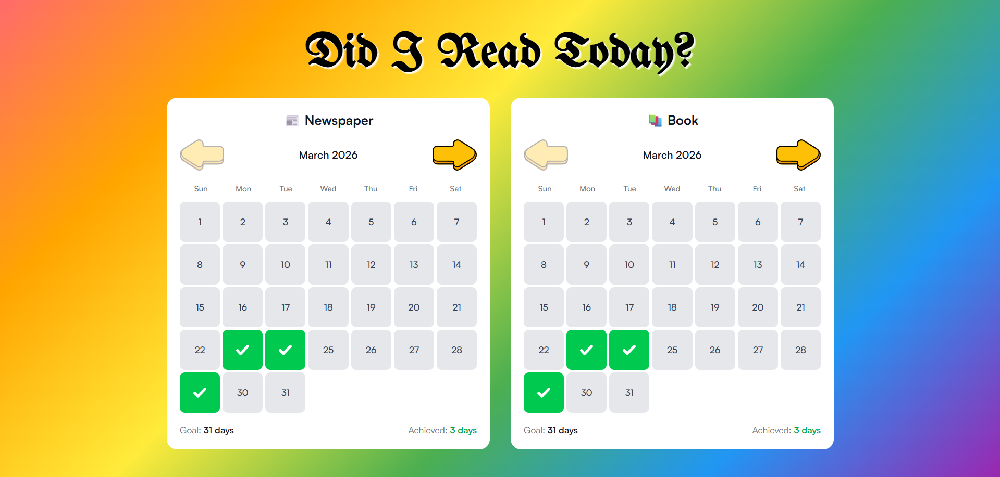

So, 11 days ago I wrote about the Frontend part of my website. I showed you the initial designs and my thought process with it. But a car cannot start with just the chassis right? We need to build the engine. And that is what I did.

I also deployed the project with my own server. Learned a thing or two about that as well.

Also, in the process of doing all that, I did something which I had never done before.

A 8 days commit streak in GitHub. Now I know in the grand scheme of things it does not matter much, but god does it look good!

So, picking up where we left off, this was how the login and homepage basically looked.

---

Simple enough. Nothing fancy. Now the thing is whenever I click on any checkbox, it did not save it, which defeats the whole purpose of the project. So we needed a database to store it. Now the main options that may pop up are MySQL and Postgres. But for the purpose of this project, they are kind of an overkill. So I settled with something which is light, literally...

*SQLite logo, courtesy of [D. Richard Hipp](https://en.wikipedia.org/wiki/D._Richard_Hipp).*

**SQLite** is a very neat little database. It is just a single file which contains all our records. It is also easy to backup. So I chose this for my project. Now I needed a schema to store the records. My initial idea was to store the type (newspaper/book), date and status (read/not read) for each row.

But when I asked if this schema was good enough to Claude, it suggested that instead of adding a status to each new row, we can make it just so that whenever a user clicks on a specific date, that date and type gets added, and whenever he clicks on it again, it gets deleted. This way, the schema will be simple and there will be no redundant data at all. And I said *voila* and went with it.

Now you may think if we just combined the day, month and year to a single date column it would be even simpler, and yes it would have been, but then we would have to manually extract them every time a new row was modified, so this purpose I avoided it.

Moving on to backend, I used **Node** and **Express** to handle my server. I created 3 API endpoints. One to login, one to fetch the habits and one to toggle them. For logging in, I used JWT and bcrypt for authentication. Basically, instead of storing the password in plain text to check the authenticity, I stored a bcrypt hash of the password in the environment variable. This way, the real password is never even mentioned anywhere.

But we cannot just login every time we open the page. I need to make sure that after the user is authenticated, the browser remember this interaction. So for this, I used JWT (JSON Web Token). After successfully verifying the credentials, the browser will be provided a secured JWT token which will be used to verify future requests, without the need to login again.

Though these are not indefinite. I made the expiry set to 10 days, so after every 10 days the user has to login again. Just for security reasons.

Now I want to share a cool neat little thing called...

*Cookie photo by [Magnific](https://www.magnific.com/free-photo/top-view-chocolate-chips-cookie_29802817.htm).*

**COOKIES!**

I always wondered how do Amazon and Instagram remember your login credentials without you needing to enter them again and again. They use cookies! Now for storing the credentials for my project, I had 2 options, either use localStorage or use cookies.

I never implemented cookies before, so I thought this was the best time to do it. The process was quite simple. After logging in, the server sends a HTTP-only cookie instead of the typical response body. The browser stores it and returns it in every successive request. On backend, *cookie-parser* reads it and JWT verifies its authenticity.

This is how it is shown in the browser UI.

Now that I had built the backend. I needed both my frontend and backend to talk with each other. Now to achieve this, I used Fetch API. I created a shared apiFetch utility that attaches the credentials to every request. And in my environment variables, I set how the URLs should be handled in production.

After doing all this, my site was complete. But everything was working... locally. If I need to access my website from anywhere, I need to deploy it to my server.

This process was what took the most time. Although the deployment was simple, it kept breaking at one point because I had not stored the \*.\****env*** files in the server. A ROOKIE MISTAKE!

I bought the server from **OVHcloud**. The server is located at Gravelines, France as all the Indian and Asian servers were exhausted. I bought the server, created a new user, set up firewall, set up SSH, and then cloned my code files to it.

Now to serve frontend files, we need a web server. I used **Nginx** for this purpose. I built all the frontend files using `npm run build` and then served it. For the backend server, which we need to keep running in background, I used **PM2**, which does this exact task.

I had bought my domain from **PorkBun** a few months back, and I manage the DNS records using **Cloudflare**. So for this project I created a new subdomain called **didiread** to my base domain [**romitraj.dev**](http://romitraj.dev). I used **Certbot** to generate SSL certificates for the site, then deployed it all.

Finally, I was able to access my website at [didiread.romitraj.dev](http://didiread.romitraj.dev). The login worked, the database worked and most importantly, the cookies did their job just fine.

At this point my project was complete. But my mentor advised me to deploy it to **Docker** as well.

*Docker logo, courtesy of [Docker](https://www.docker.com/).*

How this works is, you basically create an image of your project, now this image contains every required file and dependency for your project to work. Now anybody can just pull this image to their system, and with a single command can run your project in their system.

But for this to work, you have to create a **Dockerfile** which as its name suggests, is a file that specifies Docker what all things to build. As my project had both frontend and backend, in order to connect them inside Docker, I had to use **Supervisord**, which lets you run both Nginx (to serve website files) and Node (to host the server) in a single container.

So I created these files, then built a docker image, and then published it to **Docker Hub**, which is like the GitHub for Docker images. You can check it [here](https://hub.docker.com/r/brixdorf/did-i-read).

And my website currently looks like this..

And fun fact, during this entire process of creating and deploying this thing, I did not infact read a single page of book or newspaper, which is so IRONIC!

You can check my [GitHub](https://github.com/brixdorf/did-i-read/) if you want to take a look at the code files yourself. The README can guide you for all the steps you need to do.

So that was it then. The complete journey of my first server deployed full-stack application. Let me know about your thoughts on this. I would love to hear them all!

Till then, this is Romit, *signing off!*
