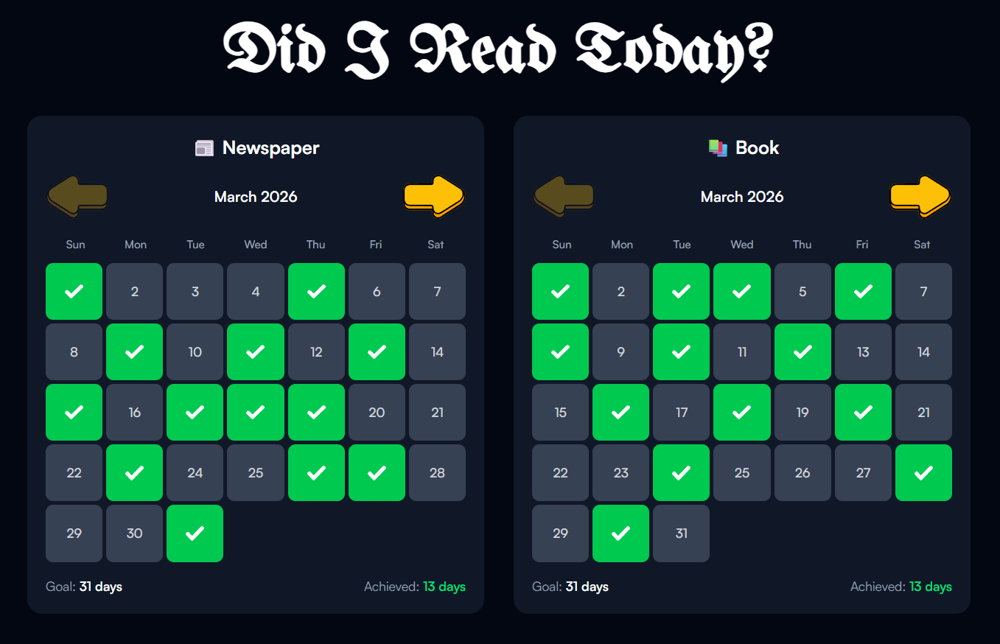

"Hiatus". What does it even mean? The dictionary says, "a pause or break in continuity in a sequence or activity". Now you may ask, what is this "activity"? Well, it may surprise you, but it is actually... Coding!?

This may look like a bummer. "A CS student who has not coded in a while?". But trust me, this is not as bad as it seems. It is not like I have not touched a piece of code for 2 months, but what I mean is, sitting in a desk, and coding for hours on straight.

Now that is something I (a bit shamefully) admit I haven't quite done in a while. And to my credit, the subjects that are currently being taught in this trimester don't really require heavy coding.

So I had been out of touch with **React** for some time. I hadn't used it too much. I felt like in order to beat procrastination as I mentioned in my previous post, I need to do something that requires manual effort and lots of coding. So I thought of creating a project in React.

*React logo, courtesy of [Meta](https://react.dev/)*

Now I am thinking, what should I even build? And then it struck me, the best way to build projects they say, is to create something to fix a problem you are facing. And I did face such a problem, and that was tracking whether I have read the newspaper and book daily.

Reading is a very very powerful and important habit. If you are not reading books or newspapers, frankly you are missing out on a lot of good stuff.

My goal daily remains to read at least one chapter of a book and read the daily newspaper. But the problem is, I cannot keep a track of whether or not I have read them on a specific day. This creates a problem which being if I miss a day or two, I get lazy and then don't read for a longer period of days.

To fix this, the best way, is to visually see what days you have read. This will create a mental model in your brain. And if you have, suppose say read for 6 days, you would not want to break the streak and make it 7, then you keep on doing this in order to maintain your reading streak.

This is a good activity and so I thought of building this exact project. Thing is, many such trackers already exist on the market, but, and this is a big but, if you just keep on using everything that is available, and not build anything yourself, will you ever learn something new?

So I started building it. I chose **React** as the framework and used **Tailwind** for styling.

My plan was simple. I needed two calendars. One for tracking newspaper, and one for books. The calendar will show each day of the month, and when one clicks on a day, it turns into a green checkbox, indicating you have read that day.

I created the base layout, used custom fonts and icons, added support for light and dark mode.

For the Calendar layout, I used CSS grid for efficiently displaying the dates in cells. The dark mode switch was especially interesting. Tailwind allows you to set the background or text color of an element when it is in dark mode with a simple `dark:` snippet. And the rest of the process of detecting whether the user is in dark mode or not is handled automatically.

And after creating all the components, the final website looked something like this.

One more important thing remains. I want this site to be accessible from the web, and it should save the progress. And to achieve these things, I need to make sure that I am the only one who is allowed to make changes to this site, otherwise anyone can mess up the logs.

So, to provide security, I added a Login page.

Up until now, this is all I have created. The frontend part is basically over, now the remaining steps include saving the data to the database, creating the backend and then deploying it to my server. I will keep sharing the updates once the remaining steps are done.

Till then, this is Romit, signing off!
