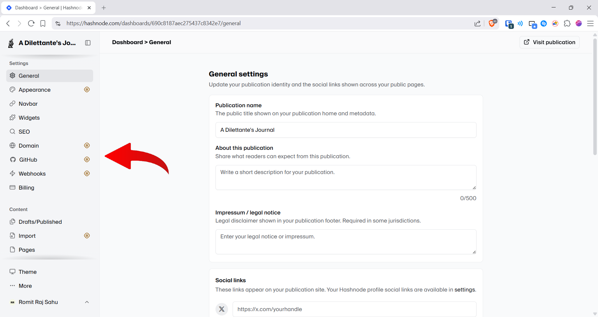
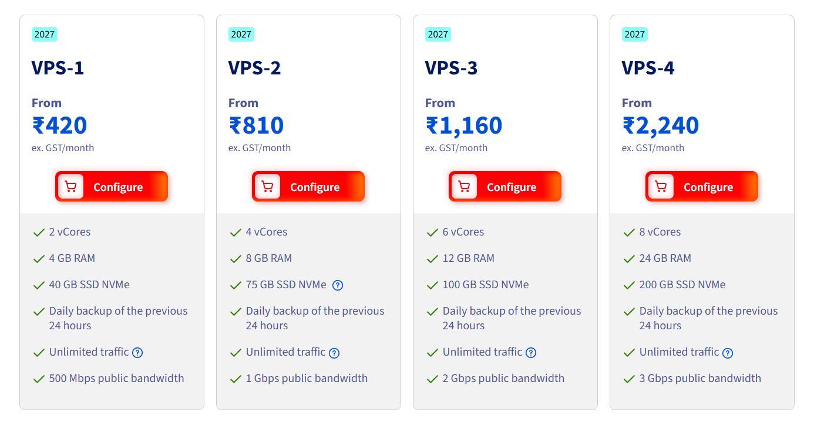

You probably use a lot of digital services where you upload your data on a regular basis. May that be a photo storage service like Google Photos, or file storage service like Google Drive, or Microsoft Office for document storage. These services may form an essential part of your digital life.

But let me ask you this, what happens, if for some reason, you are unable to access these services. We have seen in past that due to lapses in data storage practices, important data of consumers sometimes gets deleted or becomes inaccessible. Even in big tech companies, where we expect to have world class data safety systems, there have been instances where personal data of users has been deleted.

Now what happens if that unfortunate soul happens to be you? What will you do? You can't hold these lot accountable for their actions. After all, when you signed up for their services, they didn't provide you any warranty for the safe storage of your data. So, what happens then?

What I am trying to ask you is, Are you in **control** of your data? Do you **"own"** it?

For most people, the answer is going to be "no". For most, the convenience provided by these companies often becomes too large of a gap to start doing something by themselves to own their data.

But convenience will only take you so far. These companies want you to choose this path. To only use their services and not care about other more maybe slightly complicated methods which are beneficial to you.

Because through this data, they are able to maximise their growth and return value to their shareholders.

**You**, my friend, are unfortunately not the one they are serving.

Let me give you one more insight.

I was recently watching an interview by Alex Karp, the CEO of Palantir (a large data analytics company), he said that these AI companies are making unfair use of the sensitive **"alpha"** of their clients.

Now what is this **"alpha"**? In business, alpha can be attributed to the secret sauce of your company. The "thing" that your company does better than the rest for which people flock to your services. This is the single most important thing that keeps your business afloat.

Now how are these AI companies misusing this "alpha"? See, when employees of a company use tools like Claude Code in their development, Anthropic is able to see sensitive information about their company that is not visible to their competitors. They are thus then able to use this sensitive information to integrate/improve something provided by them as a service, to *of course*, generate more shareholder value.

To explain with a recent event, Anthropic's chief product officer, was a board member of Figma till the day news broke out that Anthropic's next model would ship design tools. Anthropic launched Claude Design 3 days later, a product which is a direct competitor to Figma and there have been claims that it has used Figma's unique data to improve its own design model. Can you understand how ridiculous this is?

This is the thing Alex Karp warned against.

Now, these are multi-billion corporate level stuff. But what can we do from our side, to protect what belongs to us, and to hold control of our own data?

The answer is quite simple, and it is to own a server.

When you own your server, and you store your data in it, you are the one responsible for it. You are the one who owns the data. You are the one with the keys.

Now let me be frank, this is not an end all be all solution. But owning a server and using it to store your data is magnitudes better than completely being dependent on a 3rd party multi-billion dollar company which you can't control.

---

If you've read my other posts before, you may notice that my site has changed. This is because I have migrated over from Hashnode to my own server. I have self-hosted all of this infrastructure. I will tell you more about my self-hosting journey in the coming posts, but for now, let us stick to the topic.

And boy oh boy, do I have to tell you things about Hashnode! The things I am going to tell you now are only going to strengthen the point I made earlier.

So for those of you who don't know. Hashnode is a developer platform where people share their technical blogs. It hosts the complete infrastructure for you. It provides you with the complete suite. A free subdomain, a publishing suite, a newsletter, analytics, comments and what not.

Now you may ask, if it provides all of these stuff, for free, why would I bother switching?

Hashnode has been around for quite a few years. And for the longest time, it was completely free. Its website provided you the complete suite without charging a cent. When I discovered it initially and started using it, I kept wondering, how does a service like this even make money?

Because see, remember the golden rule,

> If the product is free, you are the product.

Hashnode was VC backed. And its only goal for the longest time was to collect as many users as it could and build a userbase. Once it had achieved that, it started monetising. And monetising it did.

See this screenshot.

*Red arrow by* [Ilustrația Botanică](https://pngfolio.com/arrow-png-transparent-images)

You see the golden stars? Those are premium features. You know the catch? They were once free. Every single one of them.

Hashnode is the perfect example of a company which baits users with providing free stuff initially, only to then lock down features that were once free before, behind a paywall and asking a subscription for it.

And the beauty is, you cannot remove their branding, you cannot import from other services and you cannot even post on your own domain name!

Essentially, your blog also acts as an advertisement for their service.

See, this is exactly what I was talking about.

And **you** can avoid such stuff by owning your data i.e. owning a server.

---

Now, where do you start? Where do you even begin?

I am not saying to throw away all dependence on all 3rd party services and start to self-host everything.

What I am saying is, start small, but take the first step.

Like for me, I started by self hosting this blog.

That first step may look a bit different for you depending on your situation. But it is essential that you take it.

Now in order to get a server, there are two options. Either you make our own server or you rent one.

How do you make one? Well, if you have a spare laptop lying around, and have a constant internet connection you can start by installing `ubuntu-server` on that laptop and making that your server. After all, a server is a computer which stays online 24/7 and serves requests.

Either that, or if you're like me and don't have one lying around, or maybe you can't provide it internet 24/7, then you can rent one.

Now trust me, I have searched and compared a gazillion different services when it comes to which providers provide you the best price to performance ratio, and finally I landed upon [OVHcloud](https://www.ovhcloud.com/en-in/). You can see their services below.

*Courtesy of [OVHcloud](https://www.ovhcloud.com/en-in/vps/)*

This is not sponsored of course, but they were the one of the better providers I could find. I have been using them for quite a while and the experience so far has been good. Also, they are based in France, a EU country, so you also get good privacy and security protections.

I would recommend you to stay away from free cloud providers, because most are not reliable and you would end up getting an inferior service. Take it from a guy who had tried a lot of these when he was a teen.

---

So you can get the cheapest option to just give it a spin and get the feel of things. As I said, start small. The smallest step can create the biggest impact. And while the advantages may not be immediate, and it will even be a bit tedious at first, but rest assured you can sleep well at night knowing **you** are the one who is in control of your data. **You** have the keys.

Also, I had been in the process of migrating my blog since a few days and I have learned a lot of stuff. From hardening a server to using a Git based CMS, I am excited to share about all of them in the coming posts.

Till then, this is *Romit*, signing off.

---

**PS: *You can now comment on my posts!! Please share your opinions on this piece below. It would mean a lot to me to read your comments.***
